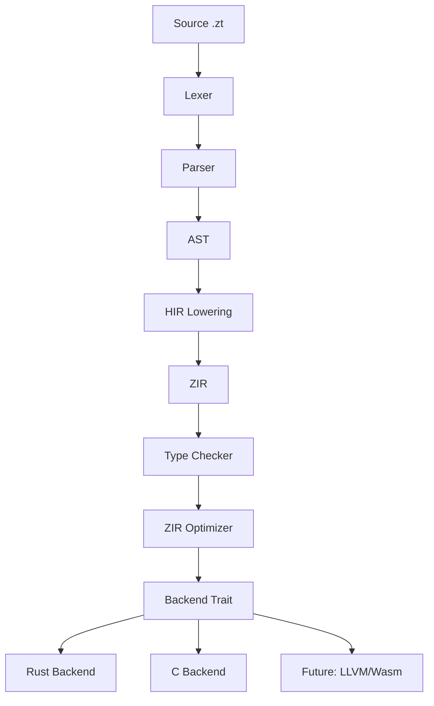

# Migration to Rust: Análise Técnica Completa

## 1. Diagnóstico da Implementação Atual em C

### 1.1 Arquitetura do Compilador e Runtime

O compilador Zenith é estruturado em múltiplas camadas:

| Camada | Arquivo Chave | Tamanho | Símbolos |
|--------|--------------|---------|----------|
| Driver/CLI | driver/main.c, pipeline.c | 11 arquivos | 609 |
| Lexer | frontend/lexer/lexer.c | 4 arquivos | 28 |
| Parser | frontend/parser/parser.c | 2 arquivos | 96 |
| AST | frontend/ast/model.c | 2 arquivos | 9 |
| HIR Lowering | hir/lowering/from_ast.c | **3701 linhas** | 93 |
| ZIR Model | zir/model.c | **42KB** | 120 |
| Semantic Binder | semantic/binder/binder.c | 1146 linhas | 48 |
| Type System | semantic/types/checker.c | **5565 linhas** | 141 |
| C Emitter | targets/c/emitter.c | **8812 linhas** | 259 |
| Runtime | runtime/c/zenith_rt.c | **231KB** | 623 |

**Fluxo de compilação:**
```
Source (.zt) → Lexer → Parser → AST → HIR Lowering → ZIR → Type Check → C Emitter → C Code → Runtime
```

### 1.2 Pontos de Acoplamento Excessivo e Fragilidade

- **Monolithic files**: Arquivos enormes que fazem demais (from_ast.c 3701 linhas, emitter.c 8812 linhas, zenith_rt.c 231KB)
- **Global state**: Diagnostics global, arena allocators
- **String ownership ambiguities**: zir_expr usa `const char*` sem ownership claro
- **Type system (checker.c 5565 linhas)**: 4 arquivos com 141 símbolos fortemente acoplados
- **C Emitter knowledge leak**: Emitter conhece detalhes do runtime C

### 1.3 Gerenciamento de Memória

- **Runtime**: ARC (Reference Counting) sem detecção de ciclos
- **Compiler**: Arena allocator + manual free patterns
- **Problema**: vazamentos em estruturas com referências cíclicas

### 1.4 Modelo de Tipos e Representação Intermediária

- **Type System**: Hindley-Milner com constraints (where clauses)
- **ZIR**: IR textual com expressions, instructions, terminators
- **Problema**: ZIR usa `const char*` para tipos — sem verificação em tempo de compilação Rust

---

## 2. Dificuldades da Implementação em C

### 2.1 Problemas Arquiteturais

| Problema | Origem | Risco |
|----------|--------|-------|
| Arquivos monolithicos | Decisões históricas | Manutenção impossível |
| Sem ownership semantics | C padrão | Use-after-free, leaks |
| Maps com busca linear |zenith_rt_outcome.c | Performance O(n) |
| Sem bounds checking | Raw pointers | Buffer overflow |
| 623 símbolos no runtime | Baixa modularização | Acoplamento temporal |

### 2.2 Pontos Frágeis

- **zenith_rt_outcome.c (4192 linhas)**: Macro explosion para outcome types
- **zenith_rt_templates.h (2638 linhas)**: Templates C para generics
- **from_ast.c**: Escopo único com 93 funções
- **Type checking**: 5565 linhas sem estrutura clara

---

## 3. Viabilidade de um Backend Rust

### 3.1 Tradução Direta (Viável)

| Componente | Esforço | Complexidade |
|-----------|---------|--------------|
| Lexer/Token | Baixo | 1:1 mapping |
| AST Model | Baixo | Structs simples |
| ZIR Model | Médio | Union → Enum |
| Binder | Médio | Ownership复杂的 |
| Type Checker | Alto | Type inference complexo |
| C Emitter | Alto | Geração de código |

### 3.2 Redesign Necessário

| Componente | Por Que |
|-----------|---------|
| Memory Management | ARC → Rust ownership |
| Error Handling | Result/Option nativos |
| Type Representation | String-based → Type-safe |
| Module System | C includes → Rust crates |

### 3.3 FFI com C Existente

O runtime C pode coexistir via `bindgen` ou reescrita incremental:

```rust
// FFI com runtime C existente
#[repr(C)]
pub struct zt_text {
    data: *mut c_char,
    len: size_t,
}
```

**Estratégia recomendada**: Manter runtime C temporariamente via FFI, reescrever depois.

### 3.4 Riscos de Migração

- Perda de paridade durante transição
- Bugs de conversão de tipos (string-based → type-safe)
- Performance de Rust vs C otimizado manualmente
- Curve de aprendizado da equipe

---

## 4. Melhor Approach Técnico em Rust

### 4.1 Arquitetura Proposta



### 4.2 Estrutura de Crates

```
zenith-compiler/
├── zenith-ast/          # AST nodes, no std
├── zenith-lexer/        # Lexer, token definitions
├── zenith-parser/       # Pratt parser
├── zenith-hir/          # High-level IR
├── zenith-zir/          # Low-level IR
├── zenith-semantic/     # Binder, Type Checker
├── zenith-codegen/      # C code generation
├── zenith-codegen-rust/ # NEW: Rust code generation
└── zenith-driver/       # CLI, pipeline orchestration
```

### 4.3 Ownership Patterns

```rust
// ZIR Expression - ownership clara
pub enum ZirExpr {
    Name(String),           // Owned string
    Int(i64),               // Direct value
    Binary {
        op: String,
        left: Box<ZirExpr>,
        right: Box<ZirExpr>,
    },
    // ...
}

// Type representation - não mais strings
pub enum Type {
    Int,
    Text,
    List(Box<Type>),
    Optional(Box<Type>),
    Result(Box<Type>, Box<Type>),
    Named(String, Vec<Type>),  // User types
}
```

### 4.4 Gerenciamento de Memória

```rust
// Arena allocator para fases do compiler
pub struct CompilerArena {
    // Bump allocator para allocations eficientes
}

// Para runtime: opção entre
// 1. Rust allocator padrão (mimalloc/jemalloc)
// 2. Reescrever coleções em Rust
// 3. Manter coleções C via FFI temporariamente
```

### 4.5 Error Handling

```rust
pub type CompilerResult<T> = Result<T, CompilerError>;

pub enum CompilerError {
    Lexer(LexerError),
    Parse(ParseError),
    Type(TypeError),
    Binder(BinderError),
    Codegen(CodegenError),
}

// Com SourceSpan para diagnósticos
pub struct SourceSpan {
    source_name: String,
    line: usize,
    column: usize,
    length: usize,
}
```

---

## 5. Legibilidade, Acessibilidade e Controle Seguro

### 5.1 Melhorias Diretas com Rust

| Aspecto | C Atual | Rust |
|---------|---------|------|
| Use-after-free | Possible | Impossible (ownership) |
| Null pointers | Common | Option<T> |
| Memory leaks | ARC manual | Compiler enforced |
| Data races | Possible | Impossible (Send/Sync) |
| Buffer overflow | Possible | Panic/Assert |

### 5.2 Testabilidade

```rust
#[cfg(test)]
mod tests {
    #[test]
    fn test_type_inference() {
        let source = "const x = 42";
        let ast = parse(source).unwrap();
        let typed = type_check(ast).unwrap();
        assert_eq!(typed[0].type_, Type::Int);
    }
}
```

### 5.3 Validação e Fuzzing

- **Rust**: `cargo fuzz`, `libfuzzer` integrado
- **Property-based testing**: `proptest` ou `quickcheck`
- **Contract testing**: Validar bounds de tipos

---

## 6. Comparação C vs Rust

| Critério | C | Rust |
|----------|---|------|
| Performance | ★★★★★ | ★★★★★ |
| Memory Safety | ★★☆☆☆ | ★★★★★ |
| Low-level Control | ★★★★★ | ★★★★☆ |
| Dev Complexity | ★★★☆☆ | ★★★☆☆ |
| Maintainability | ★★☆☆☆ | ★★★★☆ |
| Portability | ★★★★★ | ★★★★☆ |
| Observability | ★★☆☆☆ | ★★★★☆ |
| Tooling | ★★★☆☆ | ★★★★★ |
| Testability | ★★☆☆☆ | ★★★★★ |
| Interoperability | ★★★★★ | ★★★★☆ |
| Evolution | ★★☆☆☆ | ★★★★★ |

---

## 7. Estratégias de Implementação Avaliadas

### 7.1 Análise

| Estratégia | Vantagens | Desvantagens | Risco |
|------------|-----------|--------------|-------|
| **Apenas refatorar C** | Sem mudança de linguagem | Não resolve problemas fundamentais | Baixo |
| **Backend Rust incremental** | Transição suave, validação contínua | Duplicação de esforço | Médio |
| **Rewriter crítico em Rust** | Performance, segurança | Perda de paridade inicial | Alto |
| **Runtime Rust separado** | Não bloqueia compiler | Fragmentação | Médio |
| **Arquitetura híbrida C/Rust** | Melhor dos dois mundos | Complexidade de FFI | Médio |
| **Rewriter total** | Limpo, consistente | Anos de trabalho | Crítico |

### 7.2 Recomendação: **Backend Rust Incremental + Runtime Híbrido**

**Fase 1**: Criar backend Rust que targeta C via FFI
**Fase 2**: Reescrever runtime critical sections em Rust
**Fase 3**: Migrar compiler incrementalmente crate por crate

---

## 8. Plano Recomendado

### 8.1 Etapas de Implementação

#### Fase 1: Foundation (Meses 1-3)
1. Setup projeto Rust com crates existentes
2. Portar lexer e token definitions
3. Portar AST model (structs simples)
4. Escrever testes de conformidade

#### Fase 2: IR and Semantic (Meses 4-6)
1. Portar ZIR model (string → enum types)
2. Implementar ZIR parser/printer
3. Portar binder (symbol table)
4. Portar type system checker

#### Fase 3: Codegen (Meses 7-9)
1. Implementar C emitter em Rust (paridade)
2. Adicionar Rust emitter target
3. Validar equivalência de output

#### Fase 4: Runtime (Meses 10-12)
1. Identificar critical path no runtime
2. Rewriter coleções principais em Rust
3. FFI layer para runtime C legado

### 8.2 Critérios de Sucesso

- Suite de conformance passing 100%
- Performance não regredir > 5%
- Zero memory safety bugs em fuzzing
- Docs generation working

### 8.3 Validação de Equivalência

```bash
# Testar C e Rust geram mesmo output
./zenithc test.zt --emit-c -o test_c.c
./zenithc-rust test.zt --emit-c -o test_rust.c
diff test_c.c test_rust.c

# Testar binários são funcionalmente iguais
./ztc test.zt -o test_c
./zt-rust test.zt -o test_rust
./test_c == ./test_rust
```

---

## 9. Análise do Design da Linguagem Zenith

### 9.1 Pontos Fortes do Design

| Decisão | Avaliação |
|---------|-----------|
| Value semantics | Excelente - simples, previsível |
| No null (optional<T>) | Excelente - elimina UB |
| Traits + apply | Bom - композиция sobre herança |
| Where clauses | Bom - contracts explícitos |
| Match expressions | Excelente - flow control legível |
| Explicit over implicit | Excelente - filosofia consistente |

### 9.2 Áreas de Melhoria

| Aspecto | Problema | Recomendação |
|---------|----------|--------------|
| Generic constraints | onde constraints são string-based | Formalizar syntax |
| Error hierarchy | result<T,E> não tem hierarchy | Criar error types |
| Specification | Decisões em MD, não formal | Escrever SPEC.md |

### 9.3 Sintaxe - Análise

A sintaxe é deliberadamente simples e legível:
- Keywords explícitos (end, match, where, namespace)
- Sem symbols densos (apenas *, +, -, ?, :)
- Blocos visuais com end

**Ambiguidades identificadas**:
- `where` pode ser clause ou trailing expression
- Precedência de operadores não documentada formalmente

### 9.4 Sistema de Tipos

- **Modelo**: Hindley-Milner com constraints
- **Features**: Generics, traits, enums, optional, result
- **Faltando**: Higher-kinded types, existentials
- **Recomendação**: Manter simples no MVP

### 9.5 Tooling Prioritário

1. **Formatter** (existente em C) - portar para Rust
2. **LSP** (existente) - migrar para Rust compiler
3. **Fuzzer** - novo, crítico para segurança
4. **Benchmark suite** - validar performance

---

## 10. Conclusão e Recomendação

### Vale a pena desenvolver o backend em Rust?

**SIM, nas seguintes condições:**

1. **Esforço estimado**: **Alto** (12-18 meses para paridade)
2. **Problemas que resolveria**:
   - Memory safety (use-after-free, leaks, buffer overflow)
   - Manutenibilidade (arquitetura modular)
   - Testabilidade (propriedades, fuzzing)
   - Tooling moderno (cargo, clippy, miri)
   - Evolução da linguagem (novos targets)

3. **Problemas que NÃO resolveria automaticamente**:
   - Design de linguagem (sintaxe, semântica)
   - Performance runtime (requer reescrita de coleções)
   - Especificação formal (requer documento separado)

4. **Melhor approach técnico**:
   - **Backend Rust incremental** coexistindo com C backend
   - Runtime C via FFI temporário, reescrita progressiva
   - Arquitetura modular em crates Rust

### Prioridades de Melhoria

1. **Urgente**: Formal specification (SPEC.md)
2. **Urgente**: Dividir arquivos monolithicos
3. **Estrutural**: Portar lexer/parser para Rust
4. **Estrutural**: Type-safe ZIR
5. **Pós-migração**: Reescrever coleções críticas

### Resumo

A migração para Rust é **tecnicamente viável e estrategicamente correta**, mas requer investimento significativo. O maior benefício não é performance — é a **confiança**: código memory-safe, testável, evoluível. O design da linguagem Zenith é sólido e maduro; o problema é a implementação C sendo difícil de manter e evoluir.

**Recomendação final**: Iniciar com backend Rust incremental, mantendo C backend existente para validação. Após paridade, considerar reescrita do runtime. Não tentar reescrever tudo de uma vez.