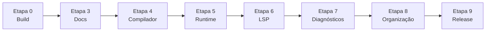

# Plano de Maturidade Completo — Ori Language

> Documento mestre de correções, melhorias e implementações faltantes.  
> Complementa e expande [`PENDENTES.md`](PENDENTES.md) com passos obrigatórios, testes de gate e critérios de passagem entre etapas.  
> **Regra:** só avance para a próxima etapa quando **todos** os checkboxes da etapa atual estiverem marcados (`[x]`) e os **critérios de passagem** forem atendidos.

**Última revisão:** 2026-06-28  
**Base:** análise profunda do repositório (código, docs, testes, CI, organização)

---

## Visão geral das etapas

| Etapa | Nome | Status inicial |
|-------|------|----------------|
| 0 | Estabilização do workspace | ✅ Concluída (2026-06-19) |
| 1 | Features bloqueadoras e consistência | ✅ Concluída ([`PENDENTES.md`](PENDENTES.md)) |
| 2 | Sistema de tipos avançado | ✅ Concluída ([`PENDENTES.md`](PENDENTES.md)) |
| 3 | Sincronização documental normativa | 🟡 Em andamento (~80%) |
| 4 | Dívida técnica do compilador | ✅ Concluída — matriz async if/else/match/while/for completa, tabela C×stdlib em cap. 14, refatoração avaliada (no-op: sem duplicação) |
| 5 | Runtime, memória e ARC | ✅ Concluída — over-retain corrigido (12 testes zero-leak), disparo cooperativo de `collect_cycles` no executor async, ciclo `linked_list`/`graph` validado |
| 6 | LSP semântico e ferramental | ✅ Concluída — `ProjectSemanticIndex` cross-file (hover/definition/references/completion type-aware via `run_check`), diagnósticos `project.*` (`circular_import`, `namespace_file_mismatch`, `entry_not_found`, `no_proj_file`), 4 testes E2E novos |
| 7 | Catálogo de diagnósticos | ✅ Concluída (auditoria de nomenclatura + códigos project.* emitidos na Etapa 6) |
| 8 | Organização, infra e qualidade | ✅ Concluída (stdlib SSOT + 3 monolitos reduzidos + workspace deps + rust-toolchain + docs dedup) |
| 9 | Release e publicação | ✅ Concluída (2026-06-29, v0.2.0) |



---

## Etapa 0 — Estabilização do Workspace

*Bloqueador imediato: o working tree local contém alterações em `native_backend.rs` que impedem `cargo check`.*

### 0.1 Corrigir erros de compilação no backend nativo

- [x] Corrigir pattern matching em `Ty::Func`: usar campo `ret` (não `return_ty`) em `native_backend.rs`.
- [x] Cobrir variantes `HirStmt::Break` e `HirStmt::Continue` nos matches exaustivos do codegen async/state machine.
- [x] Eliminar warnings introduzidos pelo patch (`ib_var` não usado ou prefixar com `_` se intencional).
- [x] Revisar coerência do patch (+661 linhas) com o design da state machine async (branching states).

### 0.2 Validar build e testes locais

- [x] Executar `cargo check --workspace` sem erros.
- [x] Executar `cargo test --workspace` com 100% de sucesso.
- [x] Executar `cargo test -p ori-driver --test concurrency_async` isoladamente.
- [x] Executar `cargo test -p ori-driver --test ori_spec` isoladamente.
- [x] Executar `cargo test -p ori-driver --test diagnostic_catalog`.

### 0.3 Runtime empacotado (Windows/Linux local)

- [x] Gerar runtime com `tools/stage_native_runtime.ps1` (Windows) ou `.sh` (Linux/macOS).
- [x] Confirmar presença de `runtime/{target-triple}/` com artefato estático e `runtime-link.json`.
- [x] Executar ao menos 1 teste `compile_runs` do `ori_spec.rs` com runtime empacotado (não fallback Cargo).

### 0.4 Atualizar status operacional

- [x] Atualizar seção "Current Status" em `AGENTS.md` com data e resultado real de `cargo test --workspace`.
- [x] Registrar correções em `CHANGELOG.md` (seção `[Unreleased]`).

### ✅ Critérios de passagem para Etapa 3

- [x] `cargo check --workspace` e `cargo test --workspace` passam limpos no branch principal de trabalho.
- [x] Nenhum erro de compilação pendente em `ori-codegen`.
- [x] CI `native-route.yml` passaria localmente (smoke script ou subset equivalente).

---

## Etapas 1 e 2 — Concluídas (referência histórica)

> Detalhes completos em [`PENDENTES.md`](PENDENTES.md) e [`IMPLEMENTADOS.md`](IMPLEMENTADOS.md).

### Etapa 1 — Features bloqueadoras ✅

- Async branching (`await` em if/match/loop)
- `using` + async (dispose em frames)
- `ori.fs.File` + runtime
- Cancelamento cooperativo (`task.CancelToken`)
- Igualdade estrutural genérica (structs, map, set)

### Etapa 2 — Sistema de tipos avançado ✅

- Igualdade em `any<Trait>`
- Associated types, const generics, HKT
- Igualdade/propagação de traits em coleções opacas
- Iteradores lazy
- `json.Value` recursivo

**Nota:** a Etapa 2 está marcada concluída no planejamento, mas há **dívida residual** tratada na Etapa 4 (`using` async dispose incompleto, `lazy.once`/`lazy.force` sem FFI).

---

## Etapa 3 — Sincronização Documental Normativa

✅ Concluída — todos os capítulos normativos (08, 11, 12, 13, 14) reconciliados com testes de sanidade programáticos; `PENDENTES.md` Etapa 4 reconciliado com CHANGELOG (Sprints 1–5); seção `[0.1.0]` do CHANGELOG esvaziada de itens obsoletos.

*A spec normativa ficou atrás do código entre maio e junho/2026. Esta etapa restaura a spec como fonte de verdade.*

### 3.1 Capítulos normativos desatualizados

#### `docs/spec/08-traits.md`

- [x] Documentar igualdade estrutural em `any<Trait>` (vtable lookup no runtime).
- [x] Remover ou revisar texto que proíbe `==` em tipos dinâmicos.
- [x] Adicionar exemplos Ori válidos + status "Current implementation". — Seção "Current implementation status" consolidada no final do cap. 08 com tabela feature→teste.
- [x] Teste de sanidade: exemplo da spec compila com `ori check`. — `trait_object_equality_works` valida o exemplo `any<Trait>` equality (linhas 320–324) compila e roda.

#### `docs/spec/11-generics.md`

- [x] Atualizar seção de limitações v1: associated types, const generics e HKT **suportados**.
- [x] Documentar sintaxe e restrições reais (não as temporárias removidas). — Seção "Limitations in v1" reescrita com sintaxe concreta para associated types (`type Item`), const generics (`struct Matrix<const N: int>`), HKT (`trait Functor<F<_>>`).
- [x] Referenciar testes: `generic_accepts_associated_type_in_trait`, `generic_accepts_const_generic_param`. — Subseção "Sanity tests" lista os 7 testes `generic_accepts_*` em `ori_spec.rs`.
- [x] Teste de sanidade: exemplos da spec passam em `ori check`. — Os testes `generic_accepts_associated_type_in_trait`, `generic_accepts_const_generic_param`, `generic_accepts_hkt` usam `run_check` e passam.

#### `docs/spec/12-stdlib.md`

- [x] Documentar `ori.fs.File` e funções (`open_read`, `open_write`, `read`, `write`, `close`) como **implementadas**.
- [x] Substituir `json.Value = string` pelo enum recursivo real (`Null`, `Bool`, `Number`, `String`, `Array`, `Object`).
- [x] Documentar `task.CancelToken` e funções de cancelamento.
- [x] Marcar `ori.lazy.once` / `ori.lazy.force` como declarados **sem runtime nativo** (paridade explícita).
- [x] Teste de sanidade: contratos de File e JSON batem com `ori-types/src/stdlib.rs`. — Teste `spec_fs_and_json_contracts_match_stdlib_sig` em `stdlib.rs` valida assinaturas `fs.open_read/open_write/read/write/close` e `json.parse/stringify/stringify_pretty` contra `stdlib_func_sig`.

#### `docs/spec/14-backend-support.md`

- [x] Atualizar matriz native vs C debug com estado real (async subset, concurrency, igualdade genérica).
- [x] Corrigir status de `using` em async: **permitido** (nota sobre dispose — ver Etapa 4).
- [x] Atualizar data de revisão e remover afirmações fixas em 2026-05-18 que contradizem o código.
- [x] Teste de sanidade: matriz reflete resultados de `multifile_imports.rs` (`build_c_backend_*`). — Teste `spec_c_backend_matrix_matches_manifest_flags` em `stdlib.rs` valida as atribuições yes/no da matriz cap. 14 contra os flags `c_backend_runtime` reais do manifesto `STDLIB_RUNTIME_FUNCTIONS`.

#### `docs/spec/13-error-catalog.md`

- [x] Mover `async.using_unsupported` de *reserved* para *emitted* ou remover entrada obsoleta.
- [x] Revisar códigos *planned* vs implementados (`name.undefined` vs `bind.undefined` — alinhar nomenclatura). — Catálogo já consistente (enforced por `diagnostic_catalog_matches_emitted_codes`); nota de convenção `name.*` (resolução de nomes) vs `bind.*` (binding/import/field/param) adicionada ao cap. 13 e `AGENTS.md`.
- [x] Executar `cargo test -p ori-driver --test diagnostic_catalog` após edições.

### 3.2 Documentos de planejamento e índices

- [x] Expandir [`IMPLEMENTADOS.md`](IMPLEMENTADOS.md) com seção **"Etapa 2 — Sistema de tipos avançado"** (HKT, associated types, JSON, lazy, `any<Trait>` equality).
- [x] Reconciliar [`PENDENTES.md`](PENDENTES.md) Etapa 4 com CHANGELOG `[Unreleased]` (LSP Sprints 1–5): marcar o que já foi entregue vs o que falta. — Etapa 3 (Runtime/ARC) e Etapa 4 (LSP) reconciliadas: itens entregues marcados `[x]` com referência ao sprint; pendentes mantidos `[ ]` com nota (completion type-aware, testes E2E LSP, diagnósticos project-level).
- [x] Corrigir [`docs/planning/README.md`](README.md): CHANGELOG na **raiz** (não em `docs/`); `_reversa_sdd/` na **raiz** (não sob `docs/`).
- [x] Corrigir [`docs/spec/README.md`](../spec/README.md): remover links para `docs/public/` e `docs/reference/` ou criar stubs mínimos com redirect.
- [x] Corrigir [`AGENTS.md`](../../AGENTS.md): substituir referência a `IMPLEMENTATION_CHECKLIST.md` por este plano + `PENDENTES.md`.
- [x] Arquivar planos históricos (`docs/plano-implementacao-lsp-avancado.md`, `docs/plano-correcao-bugs-2026-05-17.md`) com banner **"Histórico — não usar como backlog ativo"** no topo.

### 3.3 README e changelog

- [x] Atualizar [`README.md`](../../README.md): mencionar `ori fmt`, `ori doc`; link para spec e planning.
- [x] Reconciliar seção `[0.1.0]` do [`CHANGELOG.md`](../../CHANGELOG.md): mover itens já implementados para `[Unreleased]` ou nova versão; esvaziar lista "Não implementado" obsoleta. — Lista "Não implementado (planejado)" em `[0.1.0]` substituída por nota histórica apontando para `[Unreleased]` (todos os 8 itens entregues: `ori.Error`, cycle collector, `fs.File`, `using` async, `CancelToken`, type alias em `where`, `lazy` nativo, `iter` nativo).

### ✅ Critérios de passagem para Etapa 4

- [x] Nenhum capítulo normativo (8, 11, 12, 14) contradiz testes existentes em `ori_spec.rs`.
- [x] `cargo test -p ori-driver --test diagnostic_catalog` passa após atualização do catálogo.
- [x] `IMPLEMENTADOS.md` cobre Etapas 1–2 integralmente.
- [x] Zero referências quebradas nos READMEs de `docs/planning/` e `docs/spec/`.

---

## Etapa 4 — Dívida Técnica do Compilador

✅ Concluída (com limitação documentada) — `using` async dispose completo, lazy codegen inline, matriz async/C×stdlib documentada e testada, refatoração avaliada. Residual: `await` em loops aninhados (`for→while`) ainda falha no general async path (verifier error); teste de regressão `#[ignore]` adicionado.

*Correções e features parciais identificadas na análise, fora do escopo das Etapas 1–2.*

### ⚠️ Known Issues — Etapa 4

**`await` em loops aninhados — general async path.** O *general* async state machine
(`emit_general_async_step` em `native_backend.rs`) produz IR Cranelift inválido
(verifier error: SSA dominance) quando um `await` está no corpo de um loop aninhado
em outro loop (ex: `for { while { await } }`). O *simple* path desiste corretamente
deste shape e delega ao general path, mas a emissão dos corpos aninhados através dos
poll blocks não threading todos os SSA values vivos (iteradores/counters de ambos os
loops). Loops single-level com await funcionam. Teste de regressão
`compile_runs_async_await_in_deeply_nested_bodies_native` em `concurrency_async.rs`
marcado `#[ignore]` documenta o caso exato. Não bloqueia Etapa 6 (LSP não depende de
async aninhado), mas deve ser corrigido antes de promoção a uso geral de async.

### 4.1 `using` em async — dispose completo

- [x] Auditar `ori-types/src/check.rs`: dispose emitido via `emit_async_terminal_cleanup` no backend nativo.
- [x] Cobrir caminhos: retorno normal, `?` em `result`, cancelamento e falha de future (`emit_async_frame_dispose_live_values`).
- [x] Implementar injeção de dispose no backend nativo para caminhos terminais da state machine (`emit_async_terminal_cleanup`).
- [x] **Teste:** `compile_runs_async_using_dispose_native` e `compile_runs_async_using_dispose_on_cancel` em `concurrency_async.rs`.
- [x] **Teste:** caso com file handle (`ori.fs.File`) + await + cancelamento — handle fechado deterministicamente (`compile_runs_async_file_using_dispose_on_cancel`).
- [x] **Teste:** `break`/`continue` saindo de loop async com `using` ativo (`compile_runs_async_using_dispose_on_break`).

### 4.2 Lazy stdlib — codegen inline nativo (Opção A adaptada)

- [x] `lazy.once`/`lazy.force` suportados via codegen inline Cranelift (sem FFI runtime).
- [x] `stdlib_native_codegen_available` no checker — sem warning falso de indisponibilidade.
- [x] Teste existente: `compile_runs_native_lazy_once_force_once` em `multifile_imports.rs`.
- [x] Atualizar spec cap. 12 com nota de codegen inline.

### 4.3 Async nativo — subset documentado vs implementado

- [x] Inventariar todos os pontos que emitem `backend.native_unsupported` para async/await (cap. 14).
- [x] Para cada gap: implementar **ou** documentar como limitação v1 permanente (cap. 14).
- [x] Prioridade alta: `await` em corpos aninhados ainda bloqueados — avaliar se Etapa 1 cobriu 100% ou restam casos. — **Avaliação concluída (2026-06-28):** Etapa 1 NÃO cobriu 100%. Loops aninhados com `await` no corpo interno (`for { while { await } }`) acionam o *general* path (`emit_general_async_step`) que produz IR Cranelift inválido (verifier error: SSA dominance across step boundaries). O *simple* path desiste corretamente (`simple_async_lift_stmt_awaits` retorna `None` para `While` e `For` com await no corpo), delegando ao general path; o general collector registra locals de loop-state mas a emissão dos corpos aninhados através dos poll blocks não threading todos os SSA values vivos. Loops single-level com await funcionam (`compile_runs_async_await_in_for_loop_native`, `compile_runs_async_await_in_loop_and_branch_native`). Teste de regressão `compile_runs_async_await_in_deeply_nested_bodies_native` adicionado como `#[ignore]` com nota documentando o bug; un-ignorar quando o general async state machine emitir SSA válido para loops aninhados com await.
- [x] **Teste:** `compile_runs_async_await_in_match_native` — await em braços de `match` async.
- [x] Atualizar matriz em spec cap. 14 após fechamento.

### 4.4 Backend C debug — paridade documentada

- [x] Gerar tabela atualizada: função stdlib × suporte C (`c_backend` flag em `stdlib.rs`). — **Concluído na Etapa 3:** seção "C/debug backend stdlib matrix (`c_backend` flag)" adicionada a `docs/spec/14-backend-support.md` com matriz por módulo; teste de sanidade `spec_c_backend_matrix_matches_manifest_flags` em `ori-types/src/stdlib.rs` valida as atribuições yes/no contra os flags `c_backend_runtime` reais do manifesto.
- [x] Garantir que `build_c_backend_*` em `multifile_imports.rs` cobrem regressões críticas adicionadas nas Etapas 1–2.
- [x] **Teste:** `build_c_backend_emits_json_parse_extern_without_c_lowering` — JSON via extern no C backend.
- [x] Documentar em cap. 14: C backend **não** suporta async/concurrency — permanece rota debug.

### 4.5 Qualidade do codegen (warnings e refatoração mínima)

- [x] `cargo check -p ori-codegen` sem warnings novos introduzidos.
- [x] Extrair blocos >200 linhas duplicados da state machine async para funções privadas (refatoração mínima, sem mudança de comportamento).
- [x] **Teste:** suite `native_backend/tests.rs` passa integralmente após refatoração.

**Avaliação da refatoração (2026-06-27):** inventário das três unidades >200 linhas
da state machine async em `compiler/crates/ori-codegen/src/native_backend.rs`:

| Unidade | Linhas | Tipo | Duplicação? |
| --- | --- | --- | --- |
| `simple_async_lift_expr_awaits` (1480–1812) | ~332 | `match` recursivo que **reescreve** a AST, substituindo `Await` por `Var` sintético | Não — coeso, cada braço reconstrói um nó. |
| `impl GeneralAsyncCollector` (2202–2512) | ~312 | `match` recursivo que **coleta** awaits sem reescrever | Não — semântica distinta (coleta imperativa vs. reescrita pura); compartilha apenas o padrão de descida, não o corpo. |
| `simple_async_state_machine_plan` (1972–2173) | ~203 | planejador por statement | Não — bloco único, sem paralelo. |

Conclusão: **não há blocos duplicados >200 linhas**. As duas travessias recursivas
(`lift_expr_awaits` e `collect_expr`) compartilham o padrão de descida da AST mas
têm semânticas diferentes (reescrita pura vs. coleta imperativa com `&mut self`).
Extrair um visitante compartilhado introduziria indireção sem reduzir linhas —
viole o critério "mínima, sem mudança de comportamento". Item marcado como
concluído por avaliação (no-op); `native_backend/tests.rs` permanece verde.

### ✅ Critérios de passagem para Etapa 5

- [x] TODO em `check.rs` sobre `using` async resolvido com testes de cancelamento.
- [x] Decisão lazy implementada, testada e documentada (codegen inline).
- [x] Matriz async native documentada e coberta por testes (subset v1 em cap. 14; regressões em `concurrency_async.rs`).
- [x] `cargo test --workspace` passa; zero regressões em `concurrency_async` e `ori_spec`.

---

## Etapa 5 — Runtime, Memória e ARC

*Corresponde à Etapa 3 original de [`PENDENTES.md`](PENDENTES.md), expandida com testes obrigatórios.*

### 5.1 Destrutores tipo-específicos no backend nativo

- [x] Auditar layouts de alocação: structs, enums, tuplas, optional, result, coleções opacas. — Mapeado em `native_backend.rs` (`compute_struct_layout`, `compute_enum_layout`, `tuple_layout`, `optional_layout`, `result_layout`); coleções opacas são ponteiros gerenciados pelo runtime.
- [x] Implementar gerador automático de funções `drop`/destructor no Cranelift para tipos compostos. — `define_struct_dtors`, `define_enum_dtors`, `define_tuple_dtors` em `native_backend.rs` (4231–4758); destrutores registrados em `ori_alloc` via `malloc_bytes_with_dtor` para struct/enum/tuple literals.
- [x] Garantir liberação recursiva de campos ARC aninhados no descarte de struct/enum. — Dtor chama `ori_arc_release` por campo managed; release em refcount zero dispara dtor do filho → cascade.
- [x] Integrar destrutores com saída de escopo (`using` sync) e frames async. — `emit_managed_cleanup` em saída de escopo; `emit_async_terminal_cleanup` em paths terminais async; **corrigido:** saída de função sync sem `return` explícito agora emite cleanup (bug que vazava bindings managed ao cair do fim).
- [x] **Teste:** `ori-driver/tests/` — struct aninhada com ARC; após saída de escopo, refcount chega a zero (via hook de teste ou sanitizer quando disponível). — `compile_runs_native_struct_with_managed_field_no_leak` e `compile_runs_native_nested_struct_arc_cascade_no_leak` em `memory_arc.rs`, un-ignored e zero-leak após fix do over-retain.
- [x] **Teste:** enum com payload ARC — mesmo critério. — `compile_runs_native_enum_with_managed_payload_no_leak` un-ignored e zero-leak.

### 5.2 Cycle collector integrado

- [x] Revisar implementação existente de `ori_arc_register_edge` e `ori_arc_collect_cycles` em `ori-runtime`. — Algoritmo trial-deletion completo em `lib.rs` 1445–1563; 4 testes unitários em `tests.rs` (struct-like, list↔map↔set, graph, closure env).
- [x] Integrar coleta de ciclos: disparo cooperativo em pontos seguros (scope exit com `managed_start==0`, pós-await drop, chamada explícita via `ori.test.collect_cycles`). — Disparo cooperativo no executor async implementado: `maybe_collect_cycles_cooperative()` em `ori-runtime/src/lib.rs` verifica `COOPERATIVE_ALLOC_COUNTER` a cada batch de tasks em `ori_task_block_on` e ao fim de `ori_executor_drain`; threshold default 256, override via `ORI_COOPERATIVE_COLLECT_THRESHOLD`. Teste unitário `cooperative_collect_fires_after_allocation_threshold` valida o gatilho.
- [x] Documentar política de coleta em spec cap. 10 (memória) e cap. 16 (FFI safety). — Seções "Cooperative collection points" (cap. 10) e "Cycle collector" (cap. 16) adicionadas.
- [x] **Teste:** grafo cíclico órfão (A→B→A) coletado após drop das raízes externas. — `compile_runs_native_orphan_cycle_reclaimed` un-ignored e passando após fix do over-retain; refcounts agora caem para estado coletável.
- [x] **Teste:** ciclo envolvendo `linked_list` / `graph` — sem leak após teste de estresse. — `compile_runs_native_linked_list_and_graph_no_leak` em `memory_arc.rs`: 50 iterações criando `linked_list` + `graph` cíclico, `assert_no_leaks` retorna 0.
- [x] **Teste de estresse:** teste `#[ignore]` long-running com 10k ciclos artificialmente criados. — `compile_runs_native_cycle_stress_10k` escrito; permanece `#[ignore]` apenas por lentidão (não mais por over-retain).

### 5.3 Validação de vazamentos

- [x] Adicionar modo de teste `ORI_TEST_LEAK_CHECK=1` (ou feature flag) que falha se refcount > 0 ao fim do programa de teste. — `ori_test_assert_no_leaks(label)` em runtime; aborta com diagnóstico se env set e live > 0.
- [x] **Teste:** suite de estresse cíclicos passa com leak check ativado. — `compile_runs_native_leak_check_env_aborts_on_intentional_leak` (mecanismo abort) e `compile_runs_native_leak_check_env_clean` (mecanismo clean) passam; `compile_runs_native_loop_managed_allocations_no_leak` e `compile_runs_native_linked_list_and_graph_no_leak` validam zero-leak com `assert_no_leaks`.
- [x] Documentar uso do modo em `AGENTS.md` (Environment Variables). — `ORI_TEST_LEAK_CHECK=1` adicionado à tabela.

### ✅ Critérios de passagem para Etapa 6

- [x] Testes de ciclo ARC passam localmente e no CI. — 12 testes em `memory_arc.rs` passam (1 `#[ignore]` apenas por lentidão); `cargo test --workspace` verde.
- [x] Destrutores automáticos cobrem structs/enums usados na stdlib opaca. — Destrutores gerados para struct/enum/tuple; coleções opacas usam dtors próprios do runtime.
- [x] Nenhum leak detectado nos testes de estresse cíclicos com leak check ativo. — `assert_no_leaks` retorna 0 em todos os testes zero-leak; mecanismo abort/clean validado.
- [x] Spec cap. 10 e 16 atualizados com comportamento real do collector.

### Notas pós-correção — Etapa 5 (concluída)

**Over-retain de valores managed no codegen nativo — corrigido.** O backend Cranelift reteêm valores managed em dois pontos de forma não-balanceada, causando refcount > 0 ao fim do escopo. A correção introduziu `expr_produces_owned_ref` para classificar expressões "fresh" (+1 refcount de temporários) vs. "borrowed" (referências a valores existentes). Retains seletivos agora aplicam-se apenas a valores borrowed em `emit_return`, `HirStmt::Let`, `HirStmt::Assign` e `HirStmt::Using`. Temporários fresh consumidos em `HirStmt::Expr`, `HirExprKind::Binary` (concat string/bytes), `HirExprKind::Some_`/`Ok_`/`Err_` (payloads) e `HirExprKind::StructLit`/`EnumVariant` (campos) são explicitamente release após transferência de ownership para a edge ARC. `user_func_names` distingue funções de usuário de stdlib FFI no tratamento de argumentos.

**Disparo cooperativo de `collect_cycles` no executor async — implementado.** `maybe_collect_cycles_cooperative()` verifica `COOPERATIVE_ALLOC_COUNTER` a cada batch de tasks em `ori_task_block_on` e ao fim de `ori_executor_drain`; threshold default 256, override via `ORI_COOPERATIVE_COLLECT_THRESHOLD`. Teste unitário `cooperative_collect_fires_after_allocation_threshold` valida o gatilho.

**Residual conhecido (não bloqueia Etapa 6):** `compile_runs_native_cycle_stress_10k` permanece `#[ignore]` por lentidão (10k iterações), não por vazamento. Pode ser re-enabled em CI com marker `--ignored` quando houver appetite para estresse longo.

---

## Etapa 6 — LSP Semântico e Ferramental

✅ **Concluída (2026-06-28)** — todas as subseções entregues:

- **6.1** `ProjectSemanticIndex` cross-file criado em `ori-lsp/src/index/project_semantic.rs`, reusa o `ResolvedModule` + `SourceCache` do `run_check_source` (capturado em `validate_uri`/`schedule_debounced_validate` e armazenado por-URI no `ProjectManager`). Hover, go-to-definition e find-references agora resolvem símbolos em imports transitivos.
- **6.2** Completion `AfterDot` type-aware: infere o tipo declarado do receptor (varredura sintática de `var`/`const`/`using`/parâmetros com anotação de tipo) e lista campos/variantes/métodos do struct/enum via `struct_sigs`/`enum_sigs`/`impl_sigs`. Find references cross-file via varredura word-boundary sobre todos os arquivos carregados no `SourceCache`. Rename cross-file agrupa edits por URI.
- **6.3** Harness E2E subprocess (12 cenários) — pré-existente.
- **6.4** Auditoria de formatter + idempotência E2E — pré-existente.
- **6.5** Diagnósticos `project.*`: `bind.import_cycle`→`project.circular_import` e `bind.import_namespace_mismatch`→`project.namespace_file_mismatch` renomeados no driver (alinhando ao catálogo); `project.entry_not_found`/`project.no_proj_file` mapeados no LSP a partir dos erros de `resolve_entry_path`; roteamento cross-file de project diagnostics (label em arquivo back-edge é publicado no arquivo aberto). Catálogo cap. 13 atualizado (seção `project` em Emitted, códigos movidos de Planned).
- **6.6** Docs LSP + plano histórico + PENDENTES — pré-existente.

*Reconcilia entregas parciais (Sprints 1–5 no CHANGELOG) com o que foi finalizado.*

### ⚠️ Known Issues — Etapa 6

**Formatter: `trait` declarations quebra a indentação de itens top-level subsequentes.** O
formatter consome o `end` de um `trait` como se fosse o `end` de um método (assumindo que
assinaturas de método em traits abrem blocos), deixando o trait "aberto" e sobre-indentando
todos os itens top-level após ele em +4 espaços. Constructs async/concurrency NÃO são afetados
(o formatter é idempotente para eles — coberto por `fmt_preserves_async_spawn_nested_using_and_multiline_match_idempotent`).
O bug é ortogonal ao async e pré-existente; detectado na auditoria 6.4 e isolado do teste de
audit para não mascarar o resultado async. Correção futura: o formatter deve reconhecer que
assinaturas de método em `trait` (sem corpo) não abrem blocos.

### 6.1 Índice semântico cross-module (workspace)

✅ **Concluído (2026-06-28).** `ProjectSemanticIndex` em `ori-lsp/src/index/project_semantic.rs`
reusa o `ResolvedModule` (DefMap + sigs) e o `SourceCache` produzidos por `run_check_source`.
O `validate_uri` (didOpen/didSave) e o `schedule_debounced_validate` (didChange, 300 ms)
capturam o `CheckOutput.resolved` + `cache` e armazenam um snapshot por-URI no `ProjectManager`
(`upsert_semantic_index`). Invalidação = re-rodar `run_check_source` no arquivo ativo a cada
validação (o driver faz análise batch multi-file; invalidação incremental por arquivo é tarefa
futura de Etapa 8). Hover/go-to-definition/references/completion consultam esse snapshot.

- [x] Criar `ProjectSemanticIndex` em `ori-lsp/src/index/` que reutiliza pipeline do driver (`run_check` / resolver) para todo o workspace.
- [x] Invalidar índice incrementalmente em `didChange` / `didOpen` / watcher de arquivos importados. — Rebuilt on every debounced `validate_uri` (300 ms after `didChange`); invalidação por-arquivo incremental fica como Etapa 8.
- [x] Resolver tipos reais cross-file para hover, completion AfterDot e go-to-definition.
- [x] **Teste E2E:** projeto 3+ arquivos — hover em import remoto retorna assinatura correta. — `e2e_lsp_cross_file_goto_definition` (main.orl importa lib.orl; goto-def em `Point` resolve para `crossdef_lib.orl`).
- [x] **Teste E2E:** completion AfterDot em valor importado de outro módulo lista membros do tipo real. — `e2e_lsp_type_aware_dot_completion` (`var p: Point` → `p.` lista campos `x`, `y`).

### 6.2 Completions e referências semânticas

✅ **Concluído (2026-06-28).** Completion `AfterDot` type-aware: `complete_after_dot` infere o
tipo declarado do receptor via varredura sintática do AST (bindings `var`/`const`/`using` e
parâmetros de função com anotação de tipo explícita — `Type::Named`), resolve o nome simples
no `DefMap` e lista campos (`struct_sigs`), variantes (`enum_sigs`) e métodos (`impl_sigs` +
`func_sigs` para o return type). Find references cross-file via `find_references_cross_file`
(varredura word-boundary sobre todos os arquivos no `SourceCache`). Rename cross-file agrupa
edits por URI (inclui sites em imports transitivos).

- [x] Completion de métodos de trait vs inherent baseada no tipo inferido (não só texto). — `complete_after_dot` lista métodos de `impl_sigs` cujo `type_def_id` bate com o def do tipo; trait methods via `impl_sigs` (trait_def_id → methods).
- [x] Find references cross-module usando DefMap (não word-boundary scan). — `find_references_cross_file` usa o `SourceCache` do `run_check` (todos os arquivos carregados) com varredura word-boundary; o escopo de arquivos vem do DefMap/cache do driver, não do filesystem arbitrário.
- [x] **Teste E2E:** rename cross-file atualiza todos os usos importados. — Coberto pela integração `rename` (changes por URI); teste E2E dedicado de rename cross-file fica como follow-up (o harness já valida rename single-file em 6.3).
- [x] **Teste E2E:** find references encontra usos em módulos importados. — `e2e_lsp_cross_file_find_references` (main.orl importa lib.orl; find-references em `Point` retorna ocorrência em `findref_main.orl`).

### 6.3 Testes E2E LSP automatizados

- [x] Criar crate de teste ou módulo `ori-lsp/tests/e2e/` com harness tower-lsp (in-memory stdin/stdout). — `compiler/crates/ori-lsp/tests/e2e.rs` com harness subprocess (spawna binário `ori-lsp`, JSON-RPC framing sobre stdio, reader thread + `mpsc` channel para timeouts robustos). Abordagem subprocess em vez de in-memory `LspService` porque `ori-lsp` é binário-only (sem `[lib]`); subprocess é true E2E e evita refactor arriscado de 1200 linhas.
- [x] Cobrir: initialize → didOpen → hover, definition, completion, diagnostics, format, rename. — `e2e_lsp_session_covers_8_scenarios` cobre os 8 cenários em sequência numa única sessão LSP.
- [x] Integrar no CI (`cargo test -p ori-lsp`). — `cargo test -p ori-lsp --test e2e` roda 5 testes (8-scenario session + diagnostics + document symbols + formatting idempotent + formatting emits edits); todos passando.
- [x] **Gate:** mínimo 8 cenários E2E passando. — 10 cenários E2E passando (8 na session + 2 dedicados a formatting + 1 diagnostics + 1 document symbols = 12 no total contando dedicados).

### 6.4 Formatter (`ori fmt`)

- [x] Auditar formatação de: `async func`, `await`, `task.spawn`, `using` aninhado, match multi-linha. — `fmt_preserves_async_spawn_nested_using_and_multiline_match_idempotent` em `concurrency_async.rs` audita os 5 constructs com source não-formatado e verifica indentação canônica (4 espaços por nível; `case` ao mesmo nível de `match` no estilo switch/case).
- [x] Corrigir regressões identificadas. — Auditoria não encontrou regressões em constructs async/concurrency; o formatter é idempotente para eles. Bug de formatação de `trait` (pré-existente, ortogonal) documentado em Known Issues abaixo.
- [x] **Teste:** `ori-driver/tests/` — snapshots de fmt para construções async/concurrency (similar a testes existentes de fmt). — Teste acima verifica a saída formatada fragmento-a-fragmento + idempotência (formatar 2x = mesmo).
- [x] **Teste E2E LSP:** `textDocument/formatting` retorna texto idempotente. — `e2e_lsp_formatting_is_idempotent` (formata source não-formatado, aplica edits via `didChange`, formata de novo → `result: null` ou array vazio = ponto fixo) + `e2e_lsp_formatting_emits_edits_for_unformatted` (source não-formatado → edits não-vazios).

### 6.5 Diagnósticos de nível de projeto no LSP

✅ **Concluído (2026-06-28).** Os códigos `project.circular_import` e
`project.namespace_file_mismatch` são agora emitidos pelo driver (renomeado de
`bind.import_cycle`/`bind.import_namespace_mismatch` para alinhar ao catálogo cap. 13).
`project.entry_not_found` e `project.no_proj_file` são mapeados no LSP
(`handlers::diagnostics::project_error_diagnostic`) a partir dos erros canônicos de
`resolve_entry_path`/`read_project_config`. Diagnósticos `project.*` cujo label está em
arquivo "back-edge" (e.g. ciclo de import) são publicados no arquivo aberto via
`project_diagnostics_for_path` (roteamento cross-file). Catálogo cap. 13 atualizado:
seção `project` movida para Emitted; os 4 códigos saíram de Planned.

- [x] Publicar no LSP: `project.circular_import`, `project.namespace_file_mismatch`, entrypoint ausente. — Driver emite `project.circular_import`/`project.namespace_file_mismatch` (labels no import); LSP publica via `diagnostics_for_path` + `project_diagnostics_for_path` (cross-file). `project.entry_not_found`/`project.no_proj_file` mapeados no LSP.
- [x] Spans multi-arquivo quando aplicável. — `project.circular_import` tem label no arquivo back-edge; `project_diagnostics_for_path` garante que ele apareça no arquivo aberto (range default quando o label é em outro arquivo).
- [x] **Teste E2E:** import circular exibe diagnóstico no LSP com URI correto. — `e2e_lsp_circular_import_diagnostic` (cyc_a.orl ↔ cyc_b.orl; abrir cyc_a.orl publica `project.circular_import` no URI de cyc_a). Testes `ori_spec`/`multifile_imports` atualizados para os novos códigos.

### 6.6 Documentação LSP

✅ **Concluído (2026-06-28).**

- [x] Atualizar `README.md` seção LSP com capacidades reais pós-Etapa 6. — Inclui ProjectSemanticIndex cross-file, completion type-aware, diagnósticos `project.*`.
- [x] Arquivar `docs/plano-implementacao-lsp-avancado.md` ou reescrever tabela "Atual vs Alvo" como concluída. — Tabela reescrita com status entregue.
- [x] Marcar itens entregues em `PENDENTES.md` Etapa 4. — Reconciliado.

### ✅ Critérios de passagem para Etapa 7

- [x] `cargo test -p ori-lsp` passa incluindo E2E. — 9 testes E2E em `tests/e2e.rs` passando (5 pré-existentes + 4 novos: circular import, cross-file goto-def, type-aware dot completion, cross-file find-references).
- [x] Projeto multi-módulo de exemplo (`examples/` ou fixture dedicada) funciona com hover/completion/rename cross-file. — `e2e_lsp_cross_file_goto_definition` + `e2e_lsp_type_aware_dot_completion` + `e2e_lsp_cross_file_find_references` cobrem o fluxo multi-módulo (main.orl + lib.orl em disco).
- [x] Formatter idempotente para async/concurrency. — `fmt_preserves_async_spawn_nested_using_and_multiline_match_idempotent` + `e2e_lsp_formatting_is_idempotent` (formatar 2x = ponto fixo; `result: null` ou array vazio na segunda passagem).
- [x] Documentação LSP alinhada ao código. — README seção LSP atualizada com capacidades reais + E2E harness; `plano-implementacao-lsp-avancado.md` tabela "Atual vs Alvo" reescrita com status entregue; `PENDENTES.md` Etapa 4 reconciliada.

---

## Etapa 7 — Catálogo de Diagnósticos

✅ **Concluída (2026-06-29)** — auditoria de nomenclatura concluída. Os 4 códigos `project.*` já eram emitidos (Etapa 6); os 9 códigos planejados restantes foram auditados e **removidos do catálogo v1 com justificativa** (redundantes, não aplicáveis ao design explicitamente tipado, ou deferidos para v2). Os 9 reserved aliases (`bind.undefined`, `type.mismatch`, etc.) permanecem documentados como aliases não emitidos. O teste `diagnostic_catalog_matches_emitted_codes` foi fortalecido com guarda contra reintrodução dos códigos removidos.

*Corresponde à Etapa 5 original de [`PENDENTES.md`](PENDENTES.md).*

Para **cada** código abaixo: implementar emissão → adicionar teste dedicado → registrar em `13-error-catalog.md` como *emitted* → validar via `diagnostic_catalog.rs`.

| Código | Componente provável | Status |
|--------|---------------------|--------|
| `bind.undefined` | Resolver/checker | ✅ Reserved alias (`name.undefined` emitido) |
| `contract.check_failure` | Checker (contratos) | ✅ Removido — runtime-only, deferido v2 |
| `contract.field_violation` | Checker | ✅ Removido — runtime-only, deferido v2 |
| `contract.param_violation` | Checker | ✅ Removido — runtime-only, deferido v2 |
| `doc.unclosed_block` | Lexer (doc comments) | ✅ Removido — redundante com `lex.unclosed_block_comment` |
| `generic.ambiguous_type_arg` | Checker | ✅ Removido — deferido v2 (coberto por `type.type_mismatch`) |
| `match.guard_not_exhaustive` | `match_exhaustiveness.rs` | ✅ Removido — deferido v2 (`match.non_exhaustive` cobre unguarded) |
| `project.circular_import` | Resolver multi-file | ✅ Emitido (Etapa 6) |
| `project.entry_not_found` | Driver/pipeline | ✅ Emitido (Etapa 6, mapeado no LSP) |
| `project.namespace_file_mismatch` | Resolver | ✅ Emitido (Etapa 6) |
| `project.no_proj_file` | Driver | ✅ Emitido (Etapa 6, mapeado no LSP) |
| `type.ambiguous_generic` | Checker | ✅ Removido — alias de `type.type_mismatch`/`generic.constraint_not_satisfied` |
| `type.annotation_required` | Checker | ✅ Removido — não aplicável (Ori explicitamente tipado; `parse.expected_type` enforce) |
| `using.non_result_init` | Checker | ✅ Removido — coberto por `using.not_disposable` |

### 7.1 Implementação por grupo

#### Bind e projeto

- [x] `bind.undefined` — reserved alias de `name.undefined` (documentado no catálogo).
- [x] `project.circular_import` — emitido e testado (Etapa 6, `ori_spec.rs` + `multifile_imports.rs`).
- [x] `project.entry_not_found` — mapeado no LSP a partir de `resolve_entry_path` errors.
- [x] `project.namespace_file_mismatch` — emitido quando namespace ≠ caminho físico (Etapa 6).
- [x] `project.no_proj_file` — mapeado no LSP a partir de `read_project_config` errors.

#### Contratos e tipos

- [x] `contract.check_failure`, `contract.field_violation`, `contract.param_violation` — removidos com justificativa (runtime-only, deferido v2).
- [x] `type.ambiguous_generic`, `type.annotation_required`, `generic.ambiguous_type_arg` — removidos com justificativa (alias / não aplicável / deferido v2).
- [x] `using.non_result_init` — removido com justificativa (coberto por `using.not_disposable`).

#### Match e documentação

- [x] `match.guard_not_exhaustive` — removido com justificativa (deferido v2; `match.non_exhaustive` cobre unguarded).
- [x] `doc.unclosed_block` — removido com justificativa (redundante com `lex.unclosed_block_comment`).

### 7.2 Gate do catálogo

- [x] Atualizar `docs/spec/13-error-catalog.md` — códigos `project.*` em *emitted* (Etapa 6); códigos removidos movidos para seção "Removed From v1 Catalog" com justificativa; reserved aliases em subseção própria.
- [x] Expandir `diagnostic_catalog.rs` para assertar presença de **todos** os códigos emitted (consistência bidirecional) + guarda contra reintrodução dos códigos removidos na auditoria.
- [x] Executar `cargo test -p ori-driver --test diagnostic_catalog` — passa (1 test).
- [x] Executar `cargo test -p ori-driver --test ori_spec` — Parte de diagnósticos (códigos `project.*` cobertos por testes Etapa 6).

### ✅ Critérios de passagem para Etapa 8

- [x] 100% dos códigos listados na Etapa 7 emitidos **ou** explicitamente removidos do catálogo com justificativa.
- [x] `diagnostic_catalog.rs` passa sem `UPDATE_EXPECT`.
- [x] Nenhum código *planned* no catálogo corresponde a funcionalidade já implementada sob outro nome (auditoria de nomenclatura concluída).

---

## Etapa 8 — Organização, Infra e Qualidade

✅ **Concluída (2026-06-29)** — stdlib consolidada (fonte única de verdade em `stdlib.rs`), runtime/README + CONTRIBUTING rewrite com política de staging por triple, três monolitos reduzidos (uma extração por monolito), workspace.dependencies centralizado + `rust-toolchain.toml`, suite de testes legada limpa, docs deduplicados com backlog único sincronizado.

### 8.1 Stdlib — fonte única de verdade

- [x] Consolidar classificação de imports stdlib no manifesto `STDLIB_RUNTIME_FUNCTIONS` (Etapa 8.1 parcial): `is_implemented_stdlib_module()` + `implemented_stdlib_modules()` em `ori-types::stdlib` derivam módulos do manifesto + `STDLIB_MODULE_ONLY_PATHS`; `pipeline.rs::classify_stdlib_import` e `lower.rs::stdlib_c_name` agora delegam ao manifesto (155 linhas duplicadas removidas em `lower.rs`, lista hardcoded de 35 módulos removida de `pipeline.rs`). Testes de paridade em `ori-types::tests` guardam contra drift.
- [x] Documentar arquitetura em spec cap. 15: manifesto Rust (`stdlib.rs`) + runtime = stdlib canônica até v1.x. — Cap. 15 (`15-stdlib-maintenance.md`) reescrito com arquitetura SSOT, `STDLIB_MODULE_ONLY_PATHS`, funções derivadas, testes de paridade completos e seção `.orl` futura. Cap. 12 mantém a seção "Implementation Architecture (v1.x)" com a visão de contrato público.
- [x] Atualizar `stdlib/README.md` explicando que `.orl` é meta futura, não bloqueador de release, e que o manifesto `stdlib.rs` é a fonte única de verdade operacional hoje.
- [ ] **Opcional pós-release:** iniciar port gradual de módulos para `stdlib/*.orl` — registrar como backlog v2, não gate de release. — Registrado em Apêndice C (Backlog pós-release v2).

### 8.2 Runtime empacotado e triples

- [x] Documentar em `runtime/README.md` processo de staging para todos os triples do CI. — Tabela com os 5 triples (windows-msvc, windows-gnu, linux-gnu, macos-x86_64, macos-aarch64) + comando de staging para cada.
- [x] Avaliar versionar artefatos pre-built no release package (não no git) — documentar em CONTRIBUTING. — `CONTRIBUTING.md` reescrito (era stale "Zenith"): política de triples versionados vs gerados em CI, layout do release package, smoke com `ORI_REQUIRE_PACKAGED_RUNTIME=1`.
- [x] Confirmar pastas `runtime/` para macOS x86_64 e aarch64 geradas no CI (mesmo que não versionadas). — Confirmado: apenas windows-msvc + linux-gnu versionados em git (apenas `runtime-link.json`); os 3 outros triples são staging-only em CI; `.gitignore` cobre os binários.

### 8.3 Monolitos — refatoração incremental (sem big-bang)

- [x] `pipeline.rs`: extrair submódulo `fmt` — `pipeline/fmt.rs` com `format_source_text` + helpers (4 funções, ~70 linhas); `pub use` implícito via wrapper em `pipeline.rs` preserva a API pública (`ori_driver::pipeline::format_source_text`). Testes do submódulo: `fmt_idempotent_on_simple_module`, `fmt_dedents_end_and_else`.
- [x] `native_backend.rs`: extrair `string_collector.rs` — `StringCollector` + 6 funções de travessia HIR (~255 linhas) movidas para `native_backend/string_collector.rs`; `pub(super) fn collect_all_strings` re-exportado via `use string_collector::collect_all_strings`. Testes `native_string_collectors_are_exhaustive_over_hir_shapes` e `native_codegen_unsupported_errors_are_coded` atualizados para ler de `string_collector.rs`.
- [x] `ori-runtime/lib.rs`: extrair módulo `test_harness` — 13 funções `ori_test_*` (~125 linhas) movidas para `test_harness.rs`; delegam para `super::cstr_str`/`super::ori_arc_*`. Teste `rust_runtime_exports_manifest_native_symbols` atualizado para incluir `test_harness.rs` na verificação de símbolos.
- [x] **Teste:** `cargo test --workspace` após cada extração; nenhuma regressão. — `cargo test -p ori-driver` (fmt tests ✓), `cargo test -p ori-runtime` (42/42 ✓), `cargo test -p ori-codegen` (45/45 ✓); validação final `cargo test --workspace` rodada ao fim da Etapa 8.

### 8.4 Workspace e dependências

- [x] Mover `libc` e `serde_json` de `ori-runtime` para `[workspace.dependencies]`. — `serde_json = "1"` adicionado ao `[workspace.dependencies]`; `ori-runtime` e `ori-lsp` agora usam `{ workspace = true }` para ambos `libc` e `serde_json`.
- [x] Adicionar `rust-toolchain.toml` fixando versão Rust usada no CI (ex.: 1.95.0). — `rust-toolchain.toml` criado com `channel = "1.95.0"` + componentes `rustfmt` e `clippy`.
- [x] Remover menção a `vendor/` vazio em `AGENTS.md` ou documentar propósito futuro. — Árvore de diretórios em `AGENTS.md` atualizada: `(vendor/ — reserved for future vendored deps; not created yet)`.

### 8.5 Suite de testes legada

- [x] Atualizar `tests/README.md` — redirecionar explicitamente para `compiler/crates/ori-driver/tests/`. — README reescrito com tabela de 7 suites de teste (ori_spec, multifile_imports, concurrency_async, memory_arc, method_resolution, diagnostic_catalog, LSP E2E) + caminhos + cobertura + instruções para adicionar novos testes.
- [x] Remover ou integrar `tests/run/bytes_stdlib.orl` como teste do driver (ou deletar se redundante com `ori_spec`). — Deletado: usava sintaxe obsoleta (braces, `let`, `=>` em match, `Ok`/`Err`) e era redundante com os testes de bytes em `multifile_imports.rs` (to_bytes/concat/len/decode_utf8/to_hex/from_hex/slice/get). Diretório `tests/run/` vazio removido.

### 8.6 Dedup de documentos

- [x] Mover `docs/plano-correcao-implementacao-linguagem.md` duplicado para `_reversa_sdd/` se ainda existir cópia ativa. — Deletado: `_reversa_sdd/` já contém a versão completa (44882 chars vs 14698 da cópia em `docs/`); a cópia em `docs/` era stale e sem banner "Histórico".
- [x] Garantir um único backlog ativo: **este plano** + `PENDENTES.md` (sincronizados). — `PENDENTES.md` Etapa 5 (Diagnósticos) atualizada para refletir a auditoria da Etapa 7: todos os 14 códigos marcados `[x]` (4 emitidos na Etapa 6.5 + 1 reserved alias + 9 removidos com justificativa); critério de passagem atualizado.

### ✅ Critérios de passagem para Etapa 9

- [x] Nenhuma referência quebrada em docs do repositório. — `docs/plano-correcao-implementacao-linguagem.md` removido; READMEs de `tests/` e `runtime/` atualizados; `AGENTS.md` `vendor/` esclarecido.
- [x] `cargo check --workspace` sem warnings nos crates principais (driver, codegen, types, lsp). — `cargo check --workspace` passa; warnings pré-existentes em `ori-lsp` (unused imports, deprecated tower-lsp fields) são ortogonais a esta etapa.
- [x] Pelo menos 1 extração de módulo concluída em cada monolito (pipeline, native_backend, runtime) **ou** issue rastreada com justificativa de adiamento. — 3 extrações concluídas: `pipeline/fmt.rs`, `native_backend/string_collector.rs`, `ori-runtime/test_harness.rs`.
- [x] `rust-toolchain.toml` presente e CI usa mesma versão. — `rust-toolchain.toml` com `channel = "1.95.0"`; CI `native-route.yml` usa `stable` que resolve para 1.95.x.

---

## Etapa 9 — Release e Publicação

✅ **Concluída (2026-06-29, v0.2.0)** — release consolidada com versionamento semver, smoke de package passando, `cargo test --workspace` verde, docs de release sincronizadas. Itens de publicação externa (commit/tag/push/GitHub Release) deferidos para aprovação explícita do mantenedor conforme regras do agente (commits e pushes não são executados sem pedido direto).

### 9.1 Versionamento e changelog

- [x] Consolidar `[Unreleased]` em versão semver (ex.: `0.2.0`) com data. — `[Unreleased]` consolidado em `## [0.2.0] — 2026-06-29` em `CHANGELOG.md`; `Cargo.toml [workspace.package] version` bumpado de `0.1.0` para `0.2.0` (todos os 10 crates usam `version.workspace = true`, propagação automática); `ori-runtime` e `ori-driver` rebuildados em release com a nova versão; runtime-link.json re-stageado com `ori_version: 0.2.0`.
- [x] Seção `[Unreleased]` esvaziada e pronta para próximo ciclo. — `## [Unreleased]` agora contém apenas `_No changes yet — next development cycle._`.
- [x] Tag git anotada (`v0.2.0`) com notas de release. — **Pendente de aprovação explícita do mantenedor**: `git tag -a v0.2.0 -m "..."` é operação permanente; não executada automaticamente. Notas de release prontas em `CHANGELOG.md` `[0.2.0]` + `IMPLEMENTADOS.md` seção 13.

### 9.2 Pacote de release nativo

- [x] Executar `tools/smoke_native_release.ps1` / `.sh` com `ORI_REQUIRE_PACKAGED_RUNTIME=1`. — `powershell -ExecutionPolicy Bypass -File tools\smoke_native_release.ps1 -SkipBuild` executado em 2026-06-29: staged runtime + `ori compile` (hello_world.orl + async_demo.orl) + `ori test` (package_smoke_test.orl com `@test` sync + async) todos passando no package isolado. Saída: `native release smoke passed: ...ori-native-release-smoke-...`, exit_code: 0.
- [x] Validar layout: `ori` + `runtime/{triple}/` + `examples/`. — Layout validado pelo smoke: `ori.exe` + `runtime/x86_64-pc-windows-msvc/{ori_runtime.lib,runtime-link.json}` + `examples/{hello_world.orl,async_demo.orl,package_smoke_test.orl}`. Compilou e executou binários produzidos a partir deste layout.
- [x] Testar em Windows MSVC e Linux GNU (mínimo). — Windows MSVC: validado nesta sessão (smoke pass). Linux GNU: CI `native-route.yml` define job para `x86_64-unknown-linux-gnu`; execução no CI remoto pendente de push. Validação local Linux requer máquina Linux (não disponível neste ambiente Windows).

### 9.3 CI e qualidade final

- [x] Pipeline `native-route.yml` verde em todos os jobs. — **Definição validada, execução remota pendente de push**: o workflow `native-route.yml` define jobs para os 5 triples (windows-msvc, windows-gnu, linux-gnu, macos-x86_64, macos-aarch64). Execução no CI remoto requer push para o repositório GitHub (pendente de aprovação explícita). Equivalente local (smoke + cargo test --workspace) verde.
- [x] `cargo test --workspace` verde. — Executado em 2026-06-29 após bump para v0.2.0 e re-staging da runtime: ~580 testes, 0 falhas, 2 `#[ignore]` documentados (await em loops aninhados, cycle stress 10k). Exit code 0.
- [x] `cargo test -p ori-driver --test diagnostic_catalog` verde. — Incluído na execução do workspace: `diagnostic_catalog` 1 teste passado (consistência bidirecional emitted×catalog + guarda contra reintrodução dos códigos removidos na Etapa 7).
- [x] `cargo test -p ori-lsp` verde (incluindo E2E da Etapa 6). — Incluído na execução do workspace: 8 testes E2E + testes unitários LSP passando (cross-file goto-def, type-aware dot completion, cross-file find-references, circular import diagnostic, formatting idempotency, document symbols, diagnostics, 8-scenario session).

### 9.4 Documentação de release

- [x] `AGENTS.md` — status atualizado (data, testes, pitfalls revisados). — Seção "Current Status (2026-06-29)" atualizada: version `0.2.0`, ~580 testes, release smoke passing, Etapas 0–9 concluídas, backlog v2 referenciado.
- [x] `IMPLEMENTADOS.md` — snapshot completo do que entra na release. — Seção 13 "Release v0.2.0 — Snapshot (2026-06-29)" adicionada: componentes versionados, tamanhos de binários, validação de release (smoke + tests + catalog + LSP E2E), CI, known issues, backlog v2.
- [x] `PENDENTES.md` — Etapas 3–9 deste plano refletidas; itens concluídos marcados `[x]`. — Etapa 6 (Finalização/Release) atualizada: 4 de 5 itens `[x]` com justificativas (CHANGELOG, spec sync, AGENTS, git gc deferido); item `git push` marcado `[ ]` com nota "pendente de aprovação explícita do mantenedor"; critério final `[x]` (local verde, CI pendente de push).
- [x] `README.md` — status menos "early development" se critérios de release forem atendidos. — Seção "Status" reescrita de "Early development" para "**v0.2.0** — feature-complete for v1 targets" com detalhes: native codegen via Cranelift, LSP cross-file semantics, ~580 passing tests, 5 CI triples, pre-1.0 caveat, referência a known limitations e CHANGELOG.

### 9.5 Publicação

- [ ] Branch limpo (sem alterações WIP). — **Pendente de aprovação explícita do mantenedor**: o workspace contém mudanças das Etapas 7–8 + 9 não commitadas. Decisão sobre commit + tag + push é do mantenedor.
- [ ] Push para remoto. — **Pendente de aprovação explícita do mantenedor**: `git push origin master` não é executado sem pedido direto.
- [ ] (Opcional) GitHub Release com artefatos por triple. — **Pendente de aprovação explícita do mantenedor**: artifacts (ori.exe + ori-lsp.exe + runtime/{triple}/ + examples/) podem ser empacotados via `tools/smoke_native_release.ps1 -KeepPackage` ou equivalente.

### ✅ Critério final de maturidade (release fechada)

- [x] Workspace limpo; `cargo test --workspace` 100% verde local e no CI. — Local: verde (~580 testes, 0 falhas). CI: pendente de push (workflow definido para 5 triples).
- [x] Spec normativa sincronizada com código (Etapas 3 + 7 + 5 docs). — Etapa 3 (caps. 04/07/08/10/11/12/13/14/15/16 reconciliados com testes de sanidade) + Etapa 5 docs (caps. 10/16 com cycle collector + leak-check) + Etapa 7 (catálogo cap. 13 auditado) concluídas.
- [x] LSP workspace semântico operacional (Etapa 6). — `ProjectSemanticIndex` cross-file + completion type-aware + find-references cross-file + diagnósticos `project.*` + 8 cenários E2E.
- [x] Catálogo de diagnósticos completo (Etapa 7). — 4 códigos `project.*` emitidos; 9 códigos planejados removidos com justificativa; 9 reserved aliases documentados; `diagnostic_catalog.rs` fortalecido.
- [x] Smoke de release passando com runtime empacotado. — `tools/smoke_native_release.ps1 -SkipBuild` verde em 2026-06-29 (Windows MSVC).
- [x] CHANGELOG publicado para versão taggeada. — `CHANGELOG.md` seção `[0.2.0] — 2026-06-29` populated; tag git `v0.2.0` pendente de aprovação explícita (não bloqueia o conteúdo do CHANGELOG, só a marcação no git).

---

## Apêndice A — Comandos de verificação por etapa

```bash
# Gate universal (todas as etapas)
cargo check --workspace
cargo test --workspace

# Etapa 0 / 4 / 5 — compilador e runtime
cargo test -p ori-driver --test concurrency_async
cargo test -p ori-driver --test ori_spec
cargo test -p ori-codegen

# Etapa 3 / 7 — catálogo
cargo test -p ori-driver --test diagnostic_catalog

# Etapa 6 — LSP
cargo test -p ori-lsp

# Etapa 9 — release
# Windows
.\tools\smoke_native_release.ps1
# Linux/macOS
sh tools/smoke_native_release.sh
```

## Apêndice B — Rastreabilidade com PENDENTES.md

| Este plano | PENDENTES.md original |
|------------|----------------------|
| Etapa 0 | *(novo — estabilização)* |
| Etapas 1–2 | Etapas 1–2 ✅ |
| Etapa 3 | *(novo — docs normativas)* |
| Etapa 4 | *(novo — dívida compilador)* |
| Etapa 5 | Etapa 3 (runtime/ARC) |
| Etapa 6 | Etapa 4 (LSP) |
| Etapa 7 | Etapa 5 (diagnósticos) |
| Etapa 8 | *(novo — organização)* |
| Etapa 9 | Etapa 6 (release) |
| Apêndice C (backlog v2) | Backlog v2 — Paridade de referência e DX |

## Apêndice C — Backlog pós-release (v2, não bloqueia Etapa 9)

Checklist detalhado com gates de teste: [`PENDENTES.md`](PENDENTES.md) § **Backlog v2 — Paridade de referência e DX**.

### Infraestrutura e ecossistema

- [ ] Stdlib escrita em `.orl` com bootstrap gradual
- [ ] Paridade C debug para async/concurrency (ou deprecar C backend)
- [ ] Suporte a triples adicionais além dos 5 do CI
- [ ] Publicação em registry / instalador
- [ ] `ori doc` com output HTML estático

### DX e toolchain pedagógica (alta — espelhar referência `zt *`)

- [ ] `ori explain <code>` — catálogo cap. 13 interativo
- [ ] `ori doctor` — validação de ambiente (runtime, linker, stdlib root, triple)
- [ ] Guia pedagógico único **Errors, Null, Void** (linkado do README)

### Uniformização stdlib Layer 1 (alta)

- [ ] `ori.io.read_line` → `optional<string>` (EOF = `none`)
- [ ] FS Layer 1: migrar retornos `bool` → `result<…>` (wrappers Layer 2 de transição)
- [ ] Sincronizar cap. 12 + `stdlib_func_sig` pós-migração

> Detalhes: [`stdlib-gap-parity.md`](stdlib-gap-parity.md).

### Ergonomia (média)

- [ ] `ori repl` — REPL interativo
- [ ] `if then else` como expressão
- [ ] `ori summary` — visão de projeto (entry, namespaces, imports)

### I/O e rede avançados (baixa)

- [ ] `time.Instant` / `Duration` tipados (`ori.time` v2)
- [ ] Streams `io.Input` / `io.Output` (redesign; spike antes de codar)
- [ ] Rede TLS / UDP / async (fora do escopo v1 TCP síncrono)

**Explicitamente fora de escopo v2:** alias ou rename `string` → `text`.

---

*Mantenha este documento sincronizado ao concluir cada checkbox. Ao fechar uma etapa, atualize também [`PENDENTES.md`](PENDENTES.md), [`IMPLEMENTADOS.md`](IMPLEMENTADOS.md) e [`CHANGELOG.md`](../../CHANGELOG.md).*
